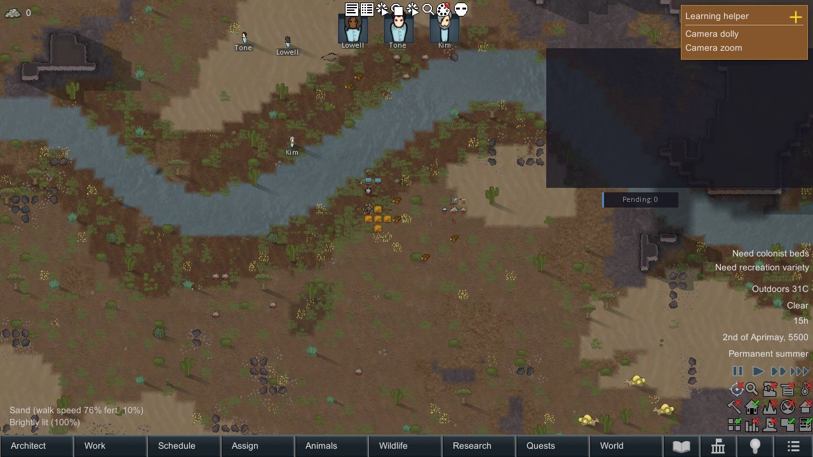
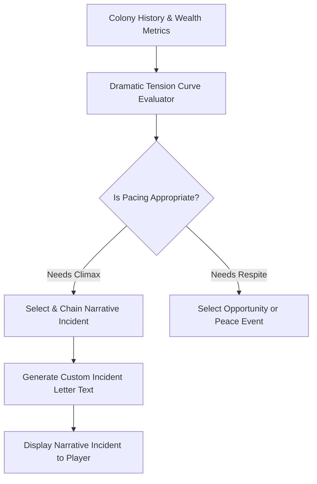

<div align="center">

# RimMind-Storyteller 📜
### AI Story Director, Dramatic Tension Tracking & Narrative Incidents for RimWorld 1.6

**English** | [简体中文](README_zh.md)

<p>
  <a href="https://rimworldgame.com/"></a>
  <a href="https://github.com/mcocdaa/RimWorld-RimMind-Mod-Core"></a>
  <a href="#"></a>
  <a href="LICENSE"></a>
</p>

<p><em>Experience a living RimWorld storyteller that crafts consequential, multi-chapter narrative drama based on your colony's real history.</em></p>

</div>

---

## 📖 Overview

**RimMind-Storyteller** reimagines RimWorld's classic storyteller AI. Instead of firing arbitrary raid dice based strictly on colony wealth graphs, the AI Storyteller acts as a genuine narrative director, assessing emotional pacing, past colony deeds, and unresolved conflicts to orchestrate coherent, multi-part sagas.

### Core Features
- **Dramatic Tension Curve**: Continuously monitors the colony's emotional equilibrium, balancing hardship, recovery, and sudden twists.
- **Contextual Narrative Incident Chains**: Connects incidents logically—e.g., a rescue of an escaped refugee might provoke a targeted retaliatory manhunt days later.
- **Custom Literary Incident Letters**: Incident notifications feature evocative, AI-composed storytelling prose that explicitly names colonists, past milestones, and geographic context.

---

## 🎮 In-Game Showcase


*Custom narrative incident letter: An AI storyteller presents an impending crisis with bespoke literary lore reflecting the colony's past choices.*

---

## 🏛️ Storyteller Director Architecture



---

## 🛠️ Installation & Load Order

```text
1. Harmony
2. Core (Vanilla RimWorld)
3. RimMind-Core
4. RimMind-Storyteller
```

---

## 🧪 Developer Guide & Testing

Run unit tests directly:

```powershell
dotnet test RimMind-Storyteller/Tests/RimMindStoryteller.Tests.csproj -c Release
```

---

## 📜 License

Licensed under the [MIT License](LICENSE).
