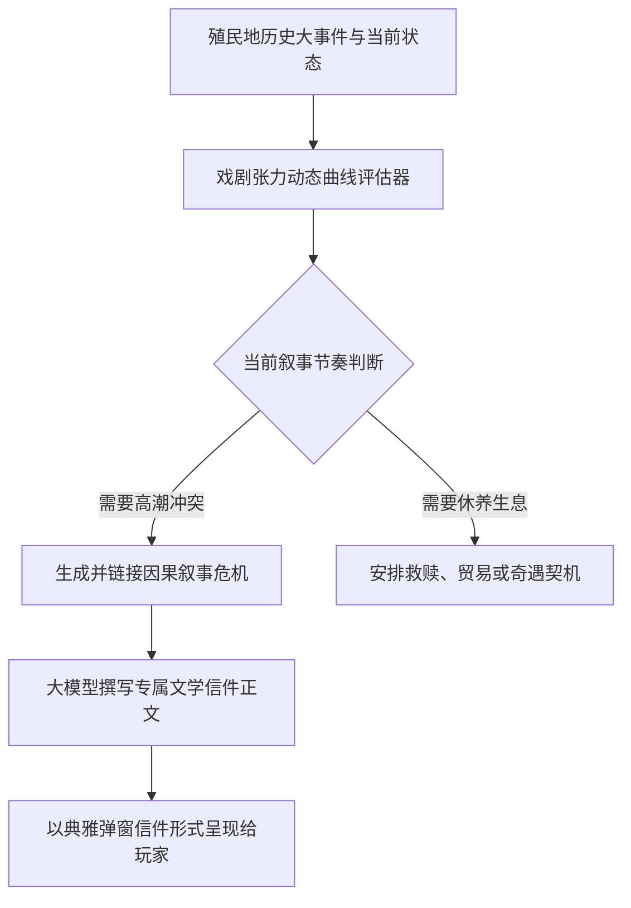

<div align="center">

# RimMind-Storyteller 📜
### 专为 RimWorld 1.6 打造的 AI 叙事导演、戏剧张力追踪与连锁事件系统

[English](README.md) | **简体中文**

<p>
  <a href="https://rimworldgame.com/"></a>
  <a href="https://github.com/mcocdaa/RimWorld-RimMind-Mod-Core"></a>
  <a href="#"></a>
  <a href="LICENSE"></a>
</p>

<p><em>告别冰冷机械的财富点数投骰，体验真正依据殖民地恩怨情仇推演的多章节戏剧史诗。</em></p>

</div>

---

## 📖 模块概览

**RimMind-Storyteller** 重塑了 RimWorld 的核心叙事体验。它不再单纯根据殖民地财产价值无脑刷怪，而是作为一名真正的故事导演，实时监控殖民地的情绪起伏、生死存亡与历史因果，编排环环相扣的多幕戏剧。

### 核心特性
- **戏剧张力动态曲线**：实时评估殖民地的心理承压极限与恢复周期，在危机关头制造跌宕起伏的转机，在承平日久时埋下危机伏笔。
- **因果相承的连锁事件链**：事件之间拥有严密的剧情逻辑——例如，收留叛逃难民可能会在数日后招致仇家精准策划的复仇夜袭。
- **文学级定制叙事信件**：事件提示信件由 AI 原生撰写，明确点名具体小人、提及过去的英雄壮举或地理地貌，代入感无与伦比。

---

## 🎮 实机特性展示


*定制剧情信件实机展示：AI 叙事者推送带有前因后果与深度文学色彩的危机事件信件。*

---

## 🏛️ 叙事导演流转架构



---

## 🛠️ 安装与加载顺序

```text
1. Harmony
2. Core (RimWorld 原版)
3. RimMind-Core
4. RimMind-Storyteller
```

---

## 🧪 开发者测试指南

运行单元测试：

```powershell
dotnet test RimMind-Storyteller/Tests/RimMindStoryteller.Tests.csproj -c Release
```

---

## 📜 开源协议

本项目采用 [MIT License](LICENSE) 开源许可证。
